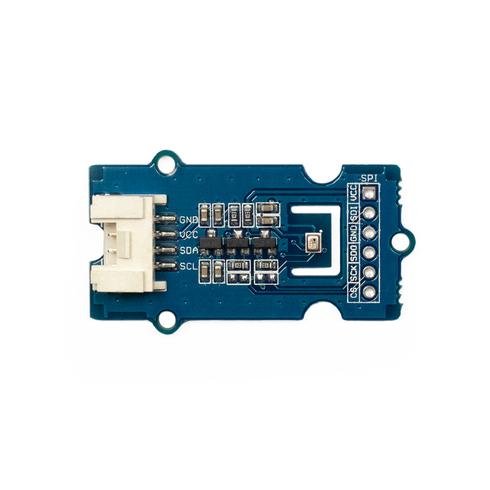

---
title: "Barometer und Temperatur Sensor"
date: "2018-10-01T12:52:13.000Z"
tags: 
  - "sensor"
coverImage: "7_barometer-und-temperatursensor.jpg"
material_number: "7"
material_type: "sensor"
material_short_descr: "Seeed Studio Grove - Barometer Sensor (BMP280)"
manufacture: "Seeed Studio"
manufacture_url: "https://www.seeedstudio.com/"
repo_name: "mks-SeeedStudio-Grove_Barometer_Sensor-BMP280"
repo_prefix: "mks"
repo_manufacture: "SeeedStudio"
repo_part: "Grove_Barometer_Sensor-BMP280"
product_url: "https://wiki.seeedstudio.com/Grove-Barometer_Sensor-BMP280/"
clone_url: "https://github.com/Make-Your-School/mks-SeeedStudio-Grove_Barometer_Sensor-BMP280.git"
embedded_example_file: "examples/Grove_Barometer_Sensor-BMP280_minimal/Grove_Barometer_Sensor-BMP280_minimal.ino"
---

# Barometer und Temperatur Sensor

## Beschreibung
Der Druck- und Temperatursensor besteht u.a. aus einem sogenannten Barometer. Dieses misst den statischen Luftdruck in der direkten Umgebung. Da der Luftdruck mit der Höhe zusammenhängt, kann dieser Sensor sowohl als Luftdruckmesser, als auch indirekt als Höhenmesser eingesetzt werden. Zusätzlich kann der Sensor die Umgebungstemperatur erfassen. Der Sensor kann direkt oder mithilfe des Grove Shields an einen Arduino oder Raspberry Pi angeschlossen werden. Der Sensor kommuniziert über die seriellen Schnittstellen I2C und SPI.

Das Modul wird beispielsweise in einer Messstation für Umweltdaten, wie Feinstaub, Lautstärke, Luftfeuchtigkeit, Luftdruck, Temperatur und UV-Strahlung eingesetzt. Alternativ kann der Sensor auch als Höhenmesser während eines Ballonflug oder in einem Gebäude verwendet werden.

Alle weiteren Hintergrundinformationen sowie ein Beispielaufbau und alle notwendigen Programmbibliotheken sind auf dem offiziellen Wiki (bisher nur in englischer Sprache) von Seeed Studio zusammengefasst. Zusätzlich findet man über alle gängigen Suchmaschinen durch die Eingabe der genauen Komponentenbezeichnung entsprechende Projektbeispiele und Tutorials.

<!-- infolist -->

<!-- infolists -->
## Wichtige Links für die ersten Schritte:

- [Seeed Studio Wiki – Barometer Sensor (BMP280)](http://wiki.seeedstudio.com/Grove-Barometer_Sensor-BMP280/)

 ## Weiterführende Hintergrundinformationen:

- [Barometer – Wikipedia Artikel](https://de.wikipedia.org/wiki/Barometer)
- [Barometrische Höhenmessung – Wikipedia Artikel](https://de.wikipedia.org/wiki/H%C3%B6henmesser)
- [I2C - Wikipedia Artikel](https://de.wikipedia.org/wiki/I%C2%B2C)
- [SPI - Wikipedia Artikel](https://de.wikipedia.org/wiki/Serial_Peripheral_Interface)
- [GitHub-Repository: Barometer- und Temperatursensor](https://github.com/MakeYourSchool/7-Barometer-und-Temperatursensor)

